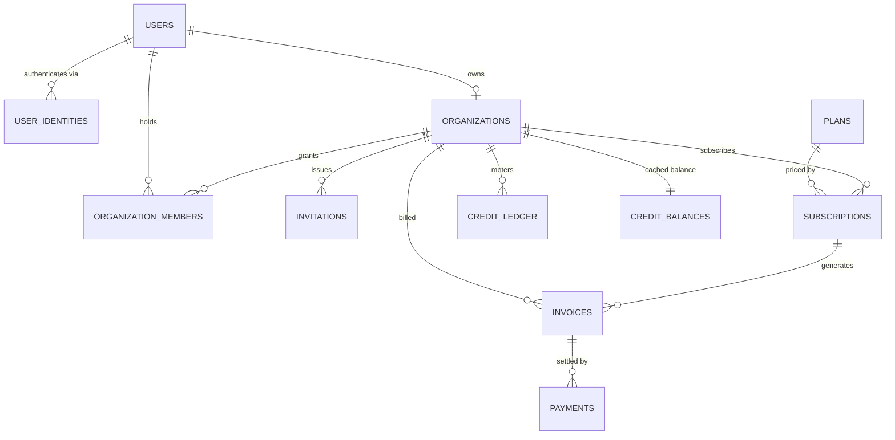
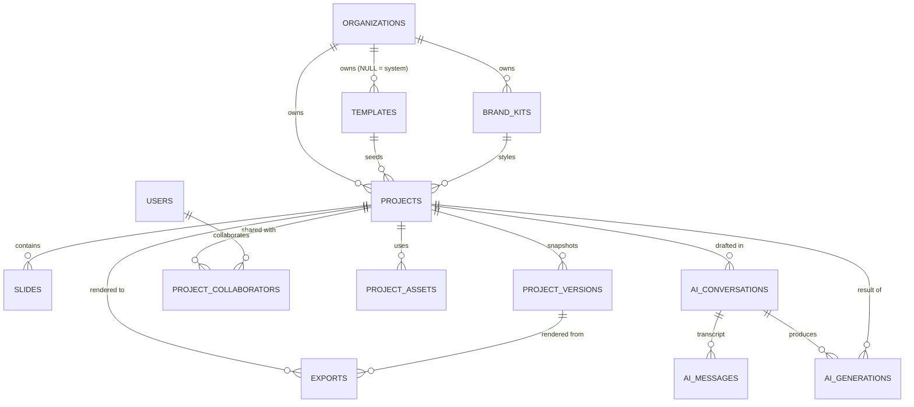
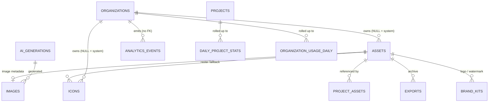

# Carousel SaaS — PostgreSQL schema

Production schema for a multi-tenant AI carousel generator: 28 tables, 154
indexes, 107 check constraints, 63 foreign keys, 29 row-level security policies,
across 9 forward-only migrations.

Baseline is **PostgreSQL 16**. Everything here has been applied to a real 16.13
cluster and exercised by [`tests/smoke.sql`](tests/smoke.sql), which asserts 44
behaviours — every constraint below has been watched reject something.

```bash
createdb carousel
for f in db/migrations/*.sql; do psql -d carousel -v ON_ERROR_STOP=1 -f "$f"; done
psql -d carousel -v ON_ERROR_STOP=1 -f db/tests/smoke.sql
```

---

## The two decisions everything else follows from

**The organization is the tenant, always.** There is no "personal project" path
alongside an "org project" path — a solo signup gets an organization of
`kind = 'personal'`. One ownership path means one authorization rule, one
`organization_id` column to filter on, and one place to enforce isolation.
Sharing a schema between "user owns it" and "org owns it" is where multi-tenant
leaks come from.

**Isolation is enforced in the database.** Row-level security keys off session
context the application sets per transaction:

```sql
BEGIN;
  SET LOCAL app.user_id         = '…';
  SET LOCAL app.organization_id = '…';
  -- every query from here is confined to that tenant
COMMIT;
```

`SET LOCAL`, so the context dies with the transaction and cannot leak across a
pooled connection. Crucially the policy checks *membership*, not just the
variable — a handler that sets an organization the user does not belong to gets
zero rows, not someone else's decks. The smoke test asserts exactly that.

---

## ER diagram

Three views rather than one hairball. Attributes are in the SQL; these show shape.

### Identity, billing, and metering



### Content, collaboration, and AI



### Media and analytics



---

## Relationships worth explaining

| Relationship | Rule | Why |
| --- | --- | --- |
| `organizations.owner_user_id` | `ON DELETE RESTRICT` | Deleting a user must not orphan a paying org. Transfer ownership first. |
| `projects.template_id` | `ON DELETE SET NULL` | Provenance, not dependency. Retiring a template cannot delete customer work. |
| `projects.brand_kit_id` | `ON DELETE SET NULL` | A deleted brand kit leaves the deck's own colours intact. |
| `slides.project_id` | `ON DELETE CASCADE` | A slide has no meaning outside its deck. |
| `project_assets.asset_id` | `ON DELETE RESTRICT` | The delete guard: an image in use cannot be removed out from under a deck. |
| `ai_conversations.project_id` | `ON DELETE SET NULL` | Threads outlive the deck for billing and audit. |
| `exports.version_id` | `ON DELETE SET NULL` | Re-downloading shows what was exported, not what the deck looks like now. |
| `credit_ledger.reference_id` | **no FK** | Billing history must not be rewritten by a project deletion. |
| `analytics_events.*` | **no FK** | See *Optimizations*. |

**Three roles, three tables.** `assets` is the physical blob — content-addressed,
one row per stored file, the only thing storage metering counts. `images` is a
1:1 extension holding dimensions, blurhash, and AI provenance. `icons` is the
vector library, system-owned or tenant-owned. Every file has exactly one storage
record and one place to delete from, while the columns stay honest: an icon has
no blurhash, a font has no alt text.

**Two representations of a deck, deliberately.** `slides` is the live document:
one row per slide, `position`-ordered, element tree in JSONB — editing needs
per-slide writes. `project_versions` stores an immutable whole-deck snapshot per
version, self-contained so a restore never depends on rows that have since
changed. Normalizing versions too would make restore a multi-table reconstruction
that a later migration could silently reinterpret.

---

## Constraints

107 check constraints. The ones that carry real weight:

**Cardinality made structural.** Partial unique indexes enforce facts the
application would otherwise have to remember:

```sql
CREATE UNIQUE INDEX organization_members_single_owner
  ON organization_members (organization_id) WHERE role = 'owner';

CREATE UNIQUE INDEX subscriptions_one_live_per_org
  ON subscriptions (organization_id)
  WHERE status IN ('trialing','active','past_due','unpaid','paused');

CREATE UNIQUE INDEX brand_kits_one_default_per_org
  ON brand_kits (organization_id) WHERE is_default AND deleted_at IS NULL;
```

An org cannot end up with two owners, two live subscriptions (a double webhook
double-charging), or two default brand kits.

**State machines that cannot lie.** A row's status and its evidence move together:

```sql
CONSTRAINT exports_success_has_asset CHECK (
  status <> 'succeeded' OR (asset_id IS NOT NULL AND completed_at IS NOT NULL))
CONSTRAINT ai_generations_success_has_output CHECK (
  status <> 'succeeded' OR output IS NOT NULL)
CONSTRAINT invoices_total_math CHECK (
  total_cents = subtotal_cents - discount_cents + tax_cents)
```

Without the first, a renderer bug marks a job successful with nothing to
download and the user gets a broken link instead of an error.

**Idempotency as a unique index.** `payments.idempotency_key`,
`ai_generations(organization_id, idempotency_key)`, and
`credit_ledger(organization_id, idempotency_key)` are unique. A redelivered
Stripe webhook or a double-clicked Generate button inserts nothing the second
time — the database refuses rather than the application remembering to check.

**Deferred uniqueness for reordering.** `slides_position_key` is
`DEFERRABLE INITIALLY DEFERRED`, so a reorder can pass through a duplicate
position mid-transaction. Note that deferred violations surface at `COMMIT`, not
at the offending statement — code that expects to catch them must use
`SET CONSTRAINTS … IMMEDIATE`.

**Append-only history.** `credit_ledger`, `payments`, `ai_messages`, and
`project_versions` reject `UPDATE`/`DELETE` from application connections via
trigger. Corrections are compensating rows. The service role bypasses this for
retention pruning through a session flag rather than by dropping the trigger.

---

## Indexes

154 indexes, chosen from the queries rather than from the columns.

**Partial indexes for the hot paths.** The export queue is the clearest case:

```sql
CREATE INDEX exports_queue_idx ON exports (queued_at) WHERE status = 'queued';
```

Workers claim with `FOR UPDATE SKIP LOCKED`. The index holds only the backlog —
a few pages — regardless of how many millions of exports have ever run. The same
shape covers stalled jobs, dunning, invitation expiry, and in-flight AI calls.

**Covering index for metering.** Storage usage is `sum(byte_size)` per tenant:

```sql
CREATE INDEX assets_org_size_idx
  ON assets (organization_id) INCLUDE (byte_size) WHERE deleted_at IS NULL;
```

`INCLUDE` keeps it index-only — the heap is never touched.

**Right index for the right search.** Full-text (`tsvector`, GIN) for projects
and templates, where users type phrases. Trigram (`gin_trgm_ops`) for icon names,
where an icon picker receives prefixes and typos that `to_tsvector` will not
match. `jsonb_path_ops` GIN on `slides.elements` — roughly a third the size of
default `jsonb_ops` because it indexes paths rather than every key, and
containment is the only operator that path is queried with.

**BRIN where the data is already ordered.** `analytics_events(occurred_at)` is
append-only and time-ordered, so BRIN gives range pruning in tens of kilobytes
where a btree would cost gigabytes.

**Composite order follows the query.** `projects (organization_id,
last_edited_at DESC) WHERE deleted_at IS NULL` serves the library screen's exact
shape — filter by tenant, sort by recency, skip the trash — in one index scan
with no sort node.

---

## Optimizations

**Denormalized counters, trigger-maintained.** `projects.slide_count`,
`templates.usage_count`, `ai_conversations.{message_count,input_tokens,cost_micros}`.
The library screen renders without touching `slides`; the gallery sorts by
popularity without counting projects. Triggers keep them honest, so no code path
can update the fact without updating the count.

**Ledger plus cached balance.** Summing `credit_ledger` per request is correct
but gets slower forever; a plain balance column is fast but drifts. Both, with
the balance written only by the ledger's own trigger, gives O(1) reads and makes
drift structurally impossible. `CHECK (balance >= 0)` is the overdraft guard: a
spend that would go negative aborts the transaction, so the AI call it was paying
for never happens.

> The smoke test caught a real bug here. The first implementation used
> `INSERT … ON CONFLICT DO UPDATE` carrying the delta — but PostgreSQL validates
> CHECK constraints against the *proposed* tuple before resolving the conflict,
> so a spend of −120 against a balance of 500 was rejected for proposing a row of
> −120. The balance it would have produced was never evaluated. Seeding at zero
> and then updating puts the check on the resulting balance, which is what it was
> always supposed to guard.

**Partitioned events.** `analytics_events` is range-partitioned by month.
Retiring a month is `DROP TABLE` in milliseconds; `DELETE` at that scale runs for
hours and leaves the heap bloated. `app.maintain_analytics_partitions()` keeps
three months of headroom so an insert never races partition creation, with a
DEFAULT partition as a safety net — rows landing there are a monitoring alert,
because attaching a new partition has to scan the default to prove nothing
belongs in it.

**No foreign keys on the event table.** Every FK is an index probe on every
insert, on the highest-volume write path in the system, protecting columns
nothing joins on transactionally. The rollup job reconciles instead.

**Dashboards never read raw events.** `daily_project_stats` and
`organization_usage_daily` are the read path. `app.roll_up_usage_for_day()` is an
idempotent upsert, so a day can be recomputed after a fix without double
counting.

**Dedupe is per tenant, not global.** Global content-addressing would store the
same bytes once across all customers, but it couples them: deleting your upload
would have to check whether another account still points at those bytes, and a
GDPR erasure could not be honoured without auditing every other organization. The
storage saving is not worth owning that.

**UUIDv7 primary keys.** Time-ordered, so inserts append to the right edge of the
btree rather than scattering across it. On tables taking millions of rows that is
the difference between a cache-resident index and one that thrashes.

---

## Migration strategy

**Forward-only, numbered, one transaction each.** `0001` … `0009`, applied in
order, each wrapped in `BEGIN`/`COMMIT` so a failure leaves nothing half-applied.
No down migrations: a rollback in production is a new forward migration written
with knowledge of what actually broke. Any tool that tracks a version table works
— Flyway, Sqitch, Atlas, `node-pg-migrate`.

**Circular references are resolved by ordering, not by nullable chaos.**
`users.avatar_asset_id` and `organizations.logo_asset_id` are declared as plain
columns in `0002` and gain their FKs in `0004` once `assets` exists;
`images.ai_generation_id` gains its FK in `0006`. Each migration is still
independently valid.

**Idempotent re-runs where it is cheap.** `app.sync_touch_triggers()` attaches
the `updated_at` trigger to any table declaring the column, so new tables get the
behaviour by declaration rather than by an author remembering. Partition creation
is `IF NOT EXISTS`-guarded.

### Rules for changing this schema safely

| Change | Safe approach |
| --- | --- |
| Add a column | `ADD COLUMN … NULL` or with a constant default (PG11+ does not rewrite). Never `NOT NULL` without a default on a large table. |
| Add `NOT NULL` | `ADD CONSTRAINT … CHECK (col IS NOT NULL) NOT VALID`, then `VALIDATE CONSTRAINT` (takes only `SHARE UPDATE EXCLUSIVE`), then convert. |
| Add an index | `CREATE INDEX CONCURRENTLY`, outside a transaction — so that migration is the one file that must not be wrapped in `BEGIN`. |
| Add a foreign key | `ADD CONSTRAINT … NOT VALID`, then `VALIDATE CONSTRAINT` separately. |
| Drop a column | Two deploys: stop writing it, then drop. Never in the same release as the code change. |
| Rename anything | Never rename in place. Add, backfill, dual-write, cut over, drop. |
| Add an enum value | `ALTER TYPE … ADD VALUE` **cannot** be used in the same transaction that then uses the value. Either run it in its own migration ahead of the one that needs it, or use a `CHECK` constraint instead. |

That last row is why `slides.role` is a `CHECK` over `text` rather than an enum:
slide roles track the layout engine and change with the product, and widening a
`CHECK` is one transactional statement. Genuinely stable domains — subscription
status, export status, org role — stay enums, where the storage and clarity win.

### Operational jobs

| Job | Cadence | Entry point |
| --- | --- | --- |
| Provision analytics partitions | monthly | `app.maintain_analytics_partitions(3)` |
| Drop partitions past retention | monthly | `DROP TABLE analytics_events_YYYYMM` |
| Roll up usage | hourly, plus a backfill pass | `app.roll_up_usage_for_day(date)` |
| Prune autosave versions | daily | keep last N per project + all labelled |
| Expire exports | daily | `exports_expiry_idx`, then drop the bytes |
| Sweep orphaned assets | daily | `assets.purge_after` |
| Expire invitations | hourly | `invitations_pending_expiry_idx` |
| Expire credit grants | daily | `credit_ledger_expiry_idx` → compensating rows |

### Known scaling limits

- **Postgres is the queue.** `exports` doubles as the work queue, which is right
  while the job is also user-visible durable state. Past a few hundred jobs a
  minute, move the claim loop to a real broker and keep this table as the record.
- **RLS on project children** uses a semi-join through `projects`. It is an index
  probe today. If a profile ever shows those policies dominating, denormalize
  `organization_id` onto `slides` and `project_versions` and switch them to
  `app.tenant_visible` — do not weaken the policy.
- **`project_versions` grows without bound** until the pruning job runs. Snapshots
  are whole documents; budget for it or move cold versions to object storage with
  only the metadata left in the row.
